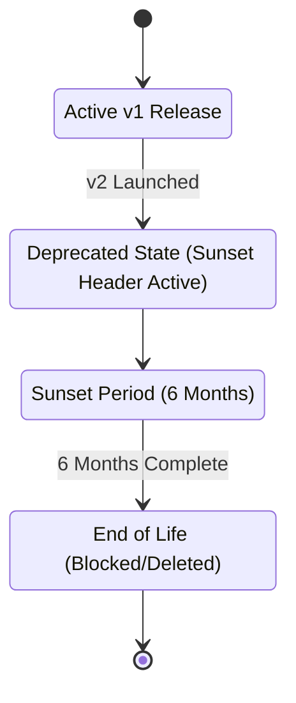

# API Versioning and Deprecation Policy

This document establishes the versioning scheme, sunset schedules, and client communication practices governing the transition of the AirGuard API from `/api/v1` to future revisions.

---

## 1. Versioning Strategy

AirGuard employs **URI-based versioning** for public endpoints:
- Current version: `/api/v1/...`
- Future updates: `/api/v2/...`

This strategy ensures clear routing boundaries at the API gateway layer (e.g. Traefik, NGINX, or Kong) and guarantees that client requests are routed cleanly without needing complex HTTP header evaluations.

---

## 2. API Deprecation Lifecycle

When introducing breaking changes that necessitate a new API version (e.g., `/api/v2/`), the legacy version enters a structured deprecation lifecycle:



### Sunset Timeline
- **Grace Period**: Revisions entering deprecation will be supported for a minimum of **6 months** after the release of the succeeding version.
- **Sunset Date**: Upon launching v2, a firm sunset date will be published in technical release notes and broadcast to all subscribing developers.

---

## 3. Communication Mechanisms: Sunset Headers

To notify client applications programmatically of deprecated endpoints, the API gateway or backend middleware will inject RFC 8594 compliant HTTP headers into all responses of the deprecated API:

```http
HTTP/1.1 200 OK
Content-Type: application/json
Deprecation: @1786017600
Sunset: Sun, 31 Jan 2027 23:59:59 GMT
Link: <https://api.airguard.sec/docs/v2>; rel="successor-version"
```

- **`Deprecation`**: Indicates the endpoint is officially deprecated, containing the Unix epoch timestamp representing when the deprecation state began.
- **`Sunset`**: The absolute timestamp when access to the endpoint will be terminated.
- **`Link`**: Link relation pointing directly to the documentation for the successor version.

---

## 4. Contract Stability & Backward Compatibility

A change is classified as **non-breaking** and will not increment the version suffix if it:
1. Adds new optional query parameters or headers.
2. Appends new fields to a response JSON payload.
3. Introduces new optional endpoints.

A change is **breaking** (requiring a route shift to v2) if it:
1. Removes or renames existing endpoint parameters.
2. Modifies field types in responses (e.g., changing an integer ID to a UUID string).
3. Alters HTTP response status codes for standard error conditions.
